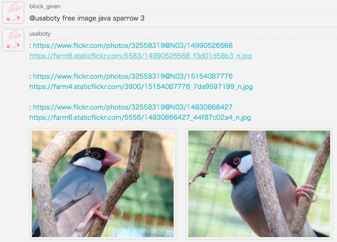

# Ruboty::FreeImage

ruboty plugin for search free images.



## Installation

Add this line to your application's Gemfile:

```ruby
gem 'ruboty-free_image'
```

And then execute:

    $ bundle

Or install it yourself as:

    $ gem install ruboty-free_image

## Usage

    @ruboty free image pigeon

## Support

- [x] flickr api
- [ ] media wiki [Allimages](http://www.mediawiki.org/wiki/API:Allimages), [Opensearch](http://www.mediawiki.org/wiki/API:Opensearch) API
- [ ] and more...

## Contributing

1. Fork it ( https://github.com/blockgiven/ruboty-free_image/fork )
2. Create your feature branch (`git checkout -b my-new-feature`)
3. Commit your changes (`git commit -am 'Add some feature'`)
4. Push to the branch (`git push origin my-new-feature`)
5. Create a new Pull Request
